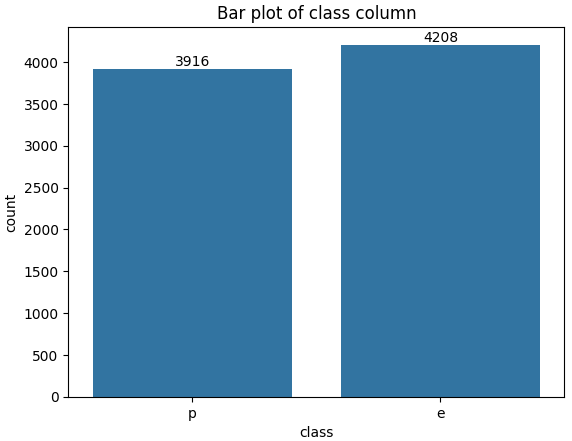
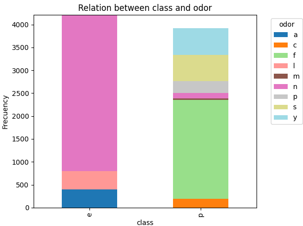
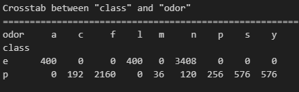
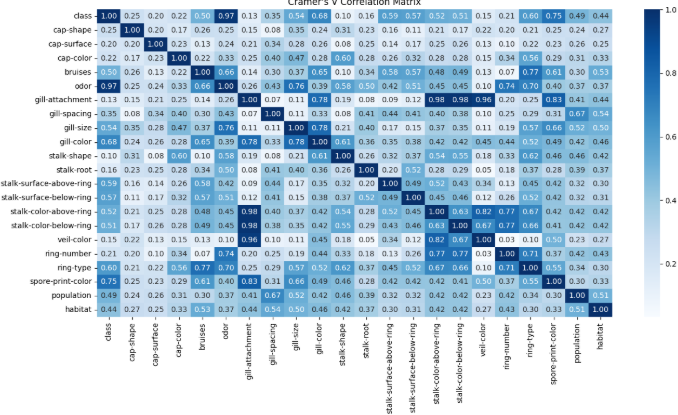
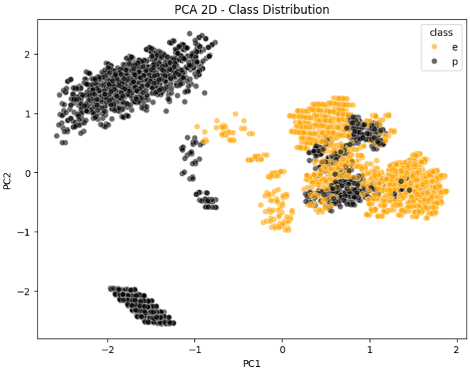
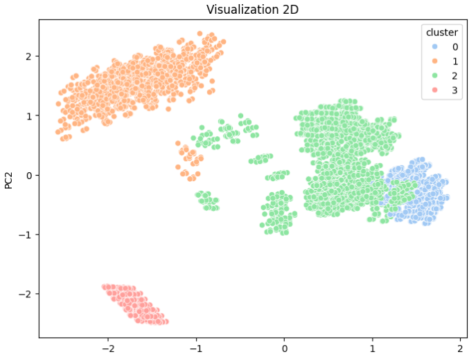
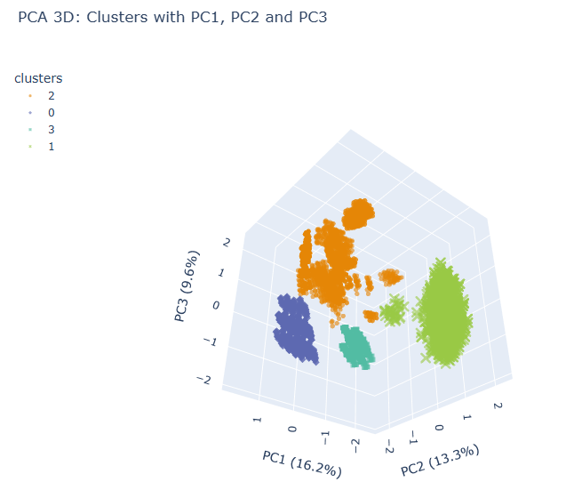
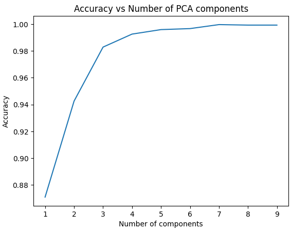
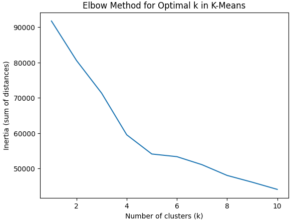
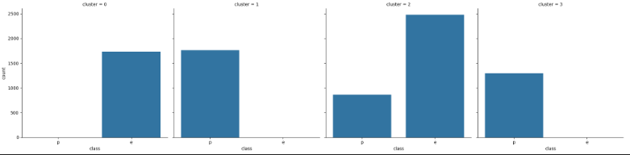

# Mushroom Classification & Unsupervised Learning

# 1. OBJECTIVE
The goal of this project is using an unsupervised model like PCA and clustering techniques in a Mushroom dataset and comparing the effect the dimensionality reduction has on a supervised model like RandomForest.

# 2. TECHNOLOGIES USED
    - Data Analysis: Pandas, Numpy, Missingno.
    - Visualization: Matplotlib, Seaborn, Plotly.
    - Machine Learning: Scikit-learn (PCA, RandomForestClassifier, KMeans).
    - Jupyter Notebooks.
    - VSCode.
    - Git.


# 3. REPOSITORY STRUCTURE

``` text
──  notebooks/
│   └── p9_unsupervised_rocio.ipynb
├── data/
│   └── data_processed
        └── mushrooms_clean.csv
        └── mushrooms_clean.parquet
    └── data_raw
        └── mushrooms.csv
└── README.md
└── requirements.txt
```
# 4. HOW TO RUN

1. Clone the repository
```text 
git clone https://github.com/Bootcamp-Data-Analyst/p9-unsupervised-rocio
```

2. Create and activate virtual environment
```text 
python -m venv .venv
```

```text 
#Windows
.venv/Scripts/activate

# Mac/Linux
source .venv/bin/activate
```

3. Install dependencies
```text 
pip install -r requirements.txt
```


# 5. DATASET

The dataset was obtained from Kaggle [Mushroom Dataset](https://www.kaggle.com/uciml/mushroom-classification).

It only contains categorical variables describing physical characteristics of mushrooms and a target variable.

It is 'class' which cointains if it is 'edible' or 'poisonous'.

# 6. DATA CLEANING

The preprocessing steps included:

- Converting all columns to categorical type.
- Checking for null values.
- Handling the '?' category in 'stalk-root' using KNN Imputation.
- Removing the 'veil-type' column (only one category).
- Checking for duplicated rows. There were none.

# 7. EXPLORATORY DATA ANALYSIS

## 7.1. Univariate Analysis
Bar plots were used to analyze the distribution of each categorical variable.



The target variable has a good distribution.

## 7.2. Bivariate Analysis
We analyzed the relationship between the target variable (class) and each feature.



Some categories perfectly separate edible and poisonous mushrooms.


Here we can see that the variable 'odor' is helpful to predict if the mushroom is 'edible' or 'poisonous'. The categories in this variable are very differentiated. Only one categor 'n' (none, pink in the figure above) in 'odor' is a little bit mixed between both classes.

## 7.3. Multivariate Analysis
Cramér’s V was used to measure associations between categorical variables.



Here we can confirm what we saw earlier: 'odor' and 'class' are very correlated.

# 8. MODELS
## 8.1. PCA (Dimensionality Reduction)

Principal Component Analysis was applied to reduce dimensionality.

- 2 and 3 components were used for visualization (2D, 3D) for class and with clusters.







- Around 8–12 components preserved most predictive power. Those components explain over  of the cumulative variance.



## 8.2. Random Forest Classifier

A Random Forest classifier was trained to predict mushroom class with and without reducing dimensionality.

| Model| Features/Components | Variance explained | Accuracy
| :--- | :--- | :--- | :--- |
| Encoded | 115 features | 100% | 1.0
| PCA | 10 components| 64% | 0.9993 |


This indicates that dimensionality reduction did not significantly reduce performance.

## 8.3. K-Means Clustering

The elbow method was used to determine the optimal number of clusters in PCA (8.1.).


It shows that bewtween 4-6 clusters it would be okay.

We made figures of those clusters and it showed partial separation between edible and poisonous mushrooms. Only one cluster has it mixed.


# 9. CONCLUSIONS

- The dataset is highly separable.
- Random Forest achieved perfect accuracy.
- PCA reduced dimensionality while maintaining performance.
- Some categorical features strongly determine mushroom toxicity.
- Unsupervised clustering partially reflects class separation.

# 10. AUTHOR
| Name| Contact |
| :--- | :--- |
| **Rocio Lozano Caro** | [](https://www.linkedin.com/in/rociolozanocaro/) [](https://github.com/rociolozanocaro) |